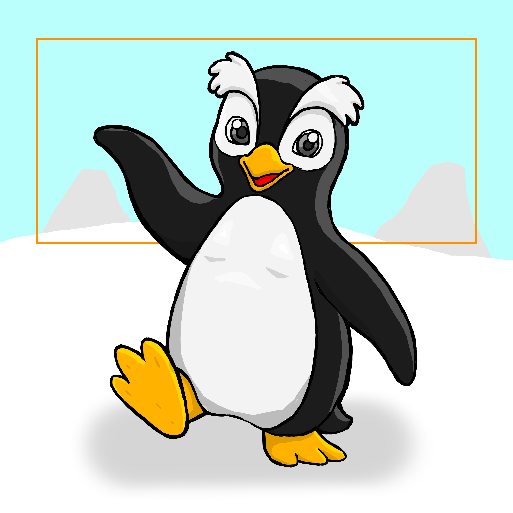

<div align="center">
  
</div>

<h1 align="center">PENGUIN</h1>

<p align="center">
A modern, embeddable, dynamically typed programming language written in Rust.
</p>

<p align="center">
Fast - Simple - Extensible - Portable
</p>

---

## About

Penguin is a lightweight scripting language designed to be embedded into applications while also supporting standalone execution.

It focuses on simplicity, good runtime performance, and an extensible architecture, making it suitable for:

- scripting
- automation
- game development
- command line tools
- applications
- plugins
- educational projects

The language is implemented entirely in Rust and exposes a clean API for integrating Penguin into native applications.

---

## Features

- Dynamic typing
- Bytecode virtual machine
- Garbage collected runtime
- Program and script execution modes
- Functions, methods, operations and modules
- Vectors, objects and structural custom types
- Mutable and immutable bindings
- Optional type hints and runtime conversions
- Object-oriented programming
- Native Rust API
- Binary compilation support
- Cross-platform
- Easy embedding

## Example

An example of Penguin code using only the core language:

```go
type Counter {
    var value: int

    func next(self) -> int {
        self.value += 1
        return self.value
    }
}

func sum(values: [any]) -> int {
    var total = 0

    for (var i = 0; i < 3; i = i + 1) {
        total += values[i]
    }

    return total
}

var counter = Counter:{ value = 0 }
return sum([counter.next(), counter.next(), counter.next()])
```

## Embedding

Penguin was designed to be embedded inside Rust applications.

```rust
use penguin::prelude::*;
```

Native functions, objects, modules and custom libraries can be registered directly through the runtime API.

Penguin itself does not require a standard library or an external ecosystem to
run. Hosts can provide their own native functions, modules, custom accessors, and
custom operations through `PengUnit`.

## Goals

The main goals of Penguin are:

- Simple syntax
- Small runtime
- Fast execution
- Easy integration
- Predictable behavior
- Extensible architecture
- Clean implementation

## Documentation
- [language](/docs/language.md)
- [archtecture](/docs/archtecture.md)
- [embedding](/docs/embedding.md)
- [binary](/docs/binary.md)
- [errors](/docs/errors.md)
